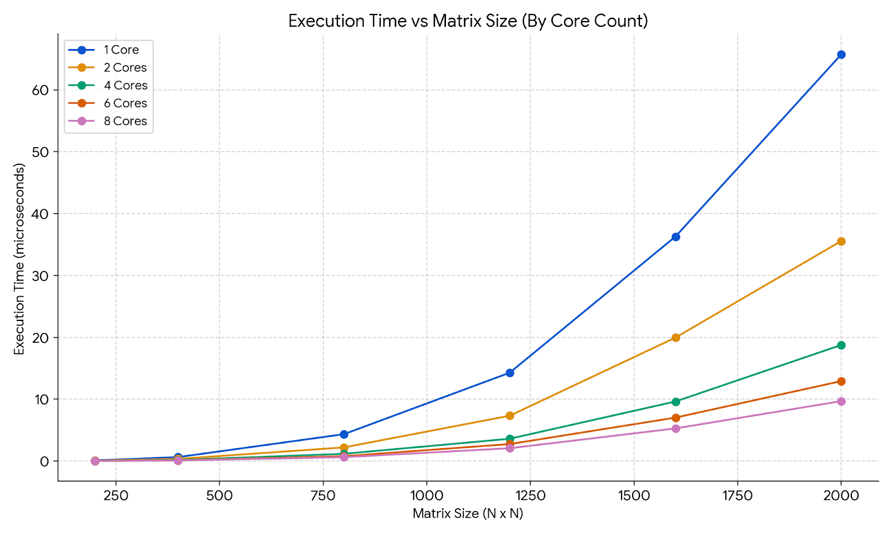

# parallel-programming-labs
Лабораторные по параллельному программированию ИБАС 4 семестр
# Анализ производительности: Время выполнения vs Размер матрицы

## Данные измерений(microseconds)

| Размер задачи | 1 ядро | 2 ядра | 4 ядра | 6 ядер | 8 ядер |
| :--- | :--- | :--- | :--- | :--- | :--- |
| **200** | 0.0907955 | 0.0562655 | 0.0258203 | 0.0167265 | 0.015443 |
| **400** | 0.63104 | 0.338893 | 0.169563 | 0.11214 | 0.0909998 |
| **800** | 4.33704 | 2.20004 | 1.16366 | 0.777759 | 0.618119 |
| **1200** | 14.2763 | 7.32306 | 3.59985 | 2.73852 | 2.06893 |
| **1600** | 36.2929 | 19.9557 | 9.62533 | 7.01743 | 5.26859 |
| **2000** | 65.7445 | 35.5711 | 18.7623 | 12.9164 | 9.68307 |

## Вывод

Параметры компиляции  mpicxx -std=c++11 main.cpp -o main
Параметры запуска  mpirun -r ssh./main 1000
При увеличивании количества ядер скорость выполнения программы существенно возрастает
Наибольшая разница наблюдается на матрицах больших размеров
Программа запущена на суперкомпьютере Сергей Королев с помощью sbatch скрипта.
Скриншоты папки на суперкомпьютере и нахождении задачи в очереди:

